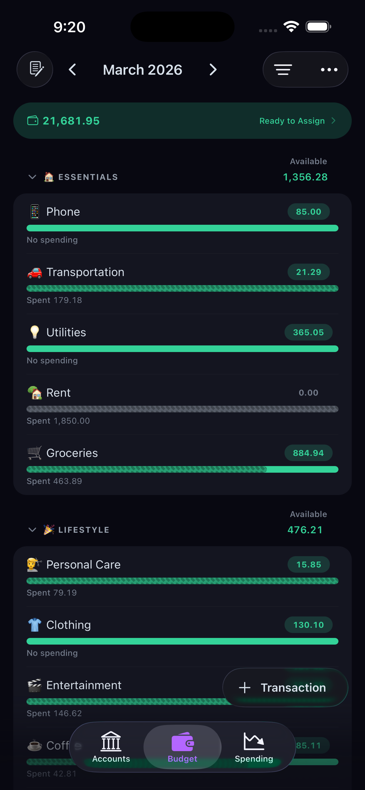
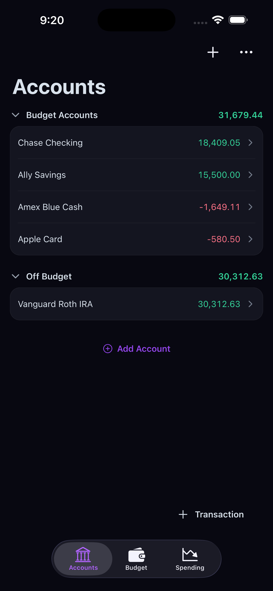
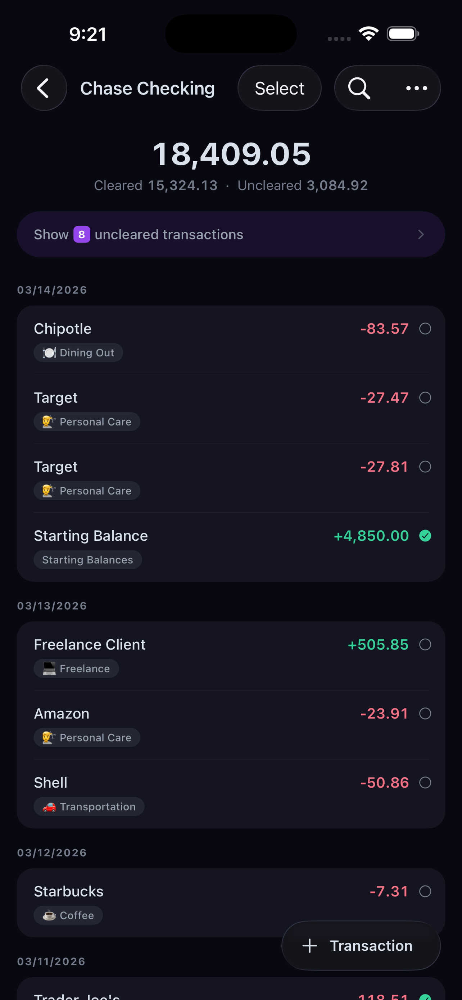
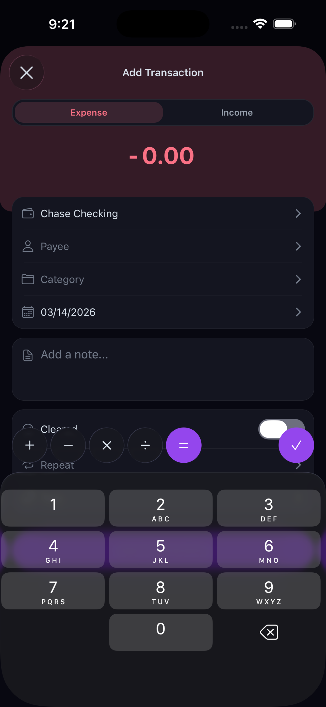
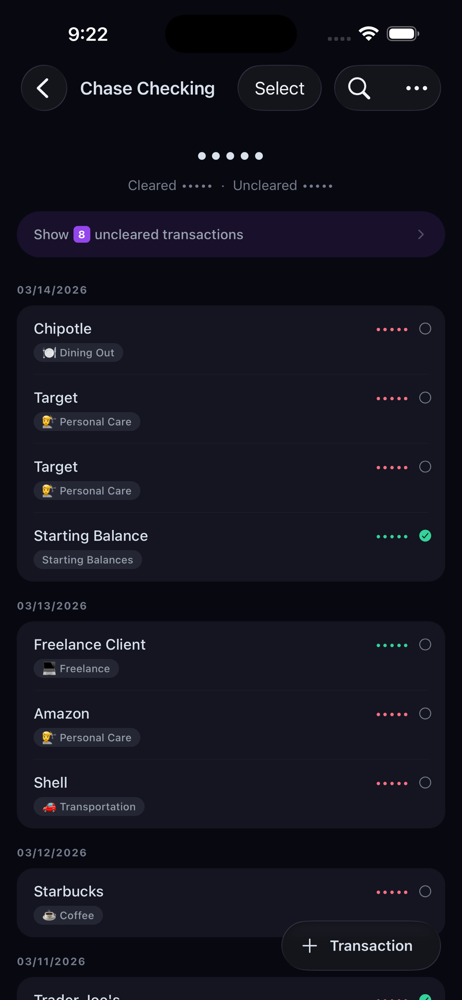
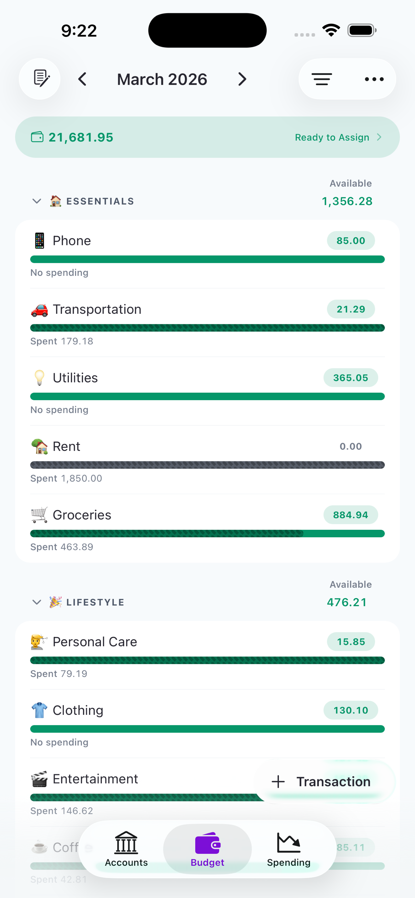

# Actual Budget Mobile

A native iOS client for [Actual Budget](https://actualbudget.com/) — the open-source, self-hosted personal finance app. Local-first, privacy-focused budgeting with CRDT-based sync.

<p align="center">
  
  
  
  
</p>

<p align="center">
  
  
</p>

## Features

- **Zero-based budgeting** — Assign every dollar to a category with goals and progress bars
- **Fast transaction entry** — Calculator toolbar, auto-category rules, under 10 seconds
- **Offline-first** — All data in SQLite on your device. Works without internet
- **Encrypted sync** — CRDT-based sync with your own server. Optional AES-256-GCM encryption
- **Privacy mode** — Blur all amounts with one tap
- **Scheduled transactions** — Recurring transactions with status tracking
- **Account reconciliation** — Match your balances with bank statements
- **Light & dark theme** — Follows your system preference
- **Multi-language** — English and Spanish (i18n with react-i18next)
- **Native iOS** — Swipe gestures, context menus, haptic feedback

## Requirements

- iOS 15+
- An [Actual Budget](https://actualbudget.com/) server (self-hosted)
  - [PikaPods](https://www.pikapods.com/pods?run=actual) (~$1-2/month, one-click setup)
  - [Docker](https://actualbudget.com/docs/install/docker)
  - [Fly.io](https://actualbudget.com/docs/install/fly)

## Getting Started

### Prerequisites

- Node.js 18+
- [Expo CLI](https://docs.expo.dev/get-started/installation/)
- Xcode 15+ (for iOS builds)

### Installation

```bash
git clone https://github.com/cubancodepath/actual-expo.git
cd actual-expo
npm install
```

### Development

```bash
# Start Expo dev server
npm start

# Build and run on iOS simulator (development variant)
npm run ios

# Build and run production variant on simulator
npm run ios:prod

# Start local Actual Budget server
docker-compose up
```

### Testing

```bash
# Unit tests (Vitest)
npm test

# Type checking
npx tsc --noEmit

# E2E tests (Maestro — requires app running in simulator)
npm run e2e
```

## Tech Stack

| Layer | Technology |
|-------|-----------|
| Framework | [Expo 55](https://expo.dev/) / [React Native 0.83](https://reactnative.dev/) |
| Navigation | [Expo Router](https://docs.expo.dev/router/introduction/) (file-based) |
| State | [Zustand 5](https://github.com/pmndrs/zustand) |
| Database | [expo-sqlite](https://docs.expo.dev/versions/latest/sdk/sqlite/) (raw SQL) |
| Sync | CRDT with Merkle tree diff (ported from Actual's loot-core) |
| Encryption | AES-256-GCM via @noble/ciphers |
| Crash reporting | [Sentry](https://sentry.io/) |
| i18n | [react-i18next](https://react.i18next.com/) |
| Testing | [Vitest](https://vitest.dev/) + [Maestro](https://maestro.mobile.dev/) |

## Architecture

```
src/
├── accounts/        # Account CRUD (raw SQL)
├── budgets/         # Budget calculations, to-budget
├── categories/      # Category queries
├── crdt/            # HLC timestamps, Merkle tree
├── db/              # SQLite connection, schema, migrations
├── encryption/      # AES-256-GCM, PBKDF2 key derivation
├── goals/           # Goal engine (schedule, savings, spending)
├── payees/          # Payee queries
├── rules/           # Auto-categorization rule engine
├── schedules/       # Recurring transactions, recurrence logic
├── services/        # Auth, budget files, encryption service
├── stores/          # Zustand stores
├── sync/            # Full sync, encoder, undo system
├── transactions/    # Transaction CRUD, queries, split logic
├── presentation/    # UI components, hooks, theme, navigation
└── i18n/            # Internationalization config

app/                 # Expo Router file-based routes
├── (public)/        # Login, onboarding
├── (files)/         # Budget file selection
└── (auth)/          # Main app (tabs, modals, settings)
```

## Contributing

Contributions are welcome! Please open an issue or submit a pull request.

## Related

- [Actual Budget](https://actualbudget.com/) — The open-source budgeting platform
- [Actual Budget GitHub](https://github.com/actualbudget/actual) — Upstream project

## License

MIT
